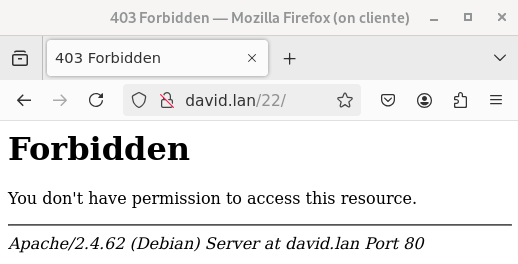
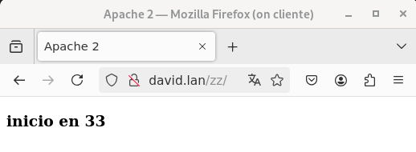
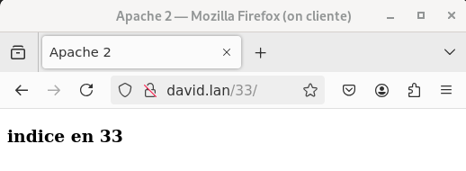

# Configuración de Servidor Virtual y DNS

## 1. Integración con Servidor DNS

Para esta tarea, necesitamos un servidor DNS dentro de la red. Puede ser una máquina independiente con `dnsmasq` o utilizar un servicio como FreeNom.

Es fundamental tener un nombre DNS válido que apunte a la dirección IP de la máquina. Supongamos que el dominio es `equipo.lan`, pero deberás adaptarlo según tu DNS.

## 2. Configuración del Servidor Virtual

Se debe configurar un servidor virtual para **www.exemplo.lan**, que también responda a **exemplo.lan** y **eql.exemplo.lan**. Este se montará en el directorio `/opt/web/exemplo.lan`.

Si utilizas una máquina virtual de Google Cloud, selecciona dos nombres dentro de los configurados en tu dominio.

### 2.1 Configuración del sitio **www.exemplo.lan**

- **Raíz de documentos:** `/opt/web/exemplo.lan/htdocs`.
- **Orden de búsqueda de archivos:**
  ```
  inicio.html, indice.html, primeiro.html
  ```
- Se debe capturar pantalla accediendo a:
  - `http://www.exemplo.lan/`
  
  - `http://www.exemplo.lan/11`
    
  - `http://www.exemplo.lan/22`
  Nos mostrará un Forbbiden ya que no hay ningún contenido que mostrar en la carpeta 22
  

### 2.2 Configuración del host virtual

- Habilitar **inclusión de servidores** y **enlaces simbólicos**.
- Crear un **enlace simbólico** `zz` dentro del directorio `33`.
- Mantener la misma prioridad de archivos en `33`.
- Capturar pantalla accediendo a:
  - `http://www.exemplo.lan/zz`
  
  - `http://www.exemplo.lan/33`
  

### 2.3 Configuración de directorios

- En **`33`**, habilitar la opción de listar contenido si no hay archivos de inicio y deshabilitar enlaces simbólicos:
  - Crear enlace simbólico `yy` en `33`, apuntando a `44`.
  - Capturar pantalla accediendo a:
    - `http://www.exemplo.lan/33/yy`
    - `http://www.exemplo.lan/33/imaxes`
    - `http://www.exemplo.lan/44`
    - `http://www.exemplo.lan/22`
- Configurar `http://www.exemplo.lan/datos` para que acceda a `/opt/web/exemplo.lan/datos` sin alterar el sistema de archivos. Capturar pantalla.

## 3. Configuración de `.htaccess` en el directorio `50`

- Habilitar `.htaccess` en `50` con las siguientes reglas:
  - **Orden de búsqueda de archivos:**
    ```
    un.html, dous.html, tres.html
    ```
  - En el subdirectorio `abc`, la prioridad será `tres.html, dous.html, un.html`.
  - **No permitir acceso** al subdirectorio `segredo`.
  - En `imaxes`, habilitar el listado de contenido si no existen archivos de inicio.
  - **Errores** en directorios sin permisos deben ser no fatales.

## 4. Cambios en la Configuración Global del Servidor

- Ajustar `<Directory>` para que todos los hosts virtuales estén en `/opt/web`.
- Analizar el impacto de:
  - `DirectoryIndex` en `DocumentRoot`.
  - Uso de `.htaccess` en `DocumentRoot`.
  - Falta de `un.html, dous.html, tres.html` en `50`.
  - Directiva no permitida en `.htaccess` (`ErrorDocument`).

## 5. Configuración Final y Pruebas

- Configurar correctamente el host virtual y la ubicación de los archivos `.htaccess`.
- Capturar pantalla de la configuración aplicada.

